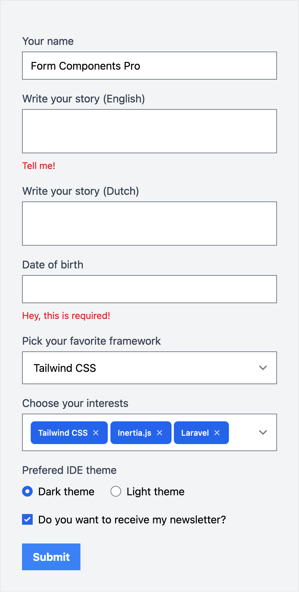

# Quick example

In the example below you'll find [two-way binding on the Form Component](/docs/reactivity.html#use-v-model-on-the-form-component), [validation error evaluation](/docs/validation.html#errors-per-form), integration with [Autosize, Choices.js and Litepicker](/docs/integration.html), and the [Group component](/docs/misc.html#group-component).

```js
<template>
  <div id="app">
    <Form class="p-8 max-w-md" v-model="user" :errors="errors">
      <Input name="name" label="Your name" />

      <Textarea name="biography.en" label="Write your story (English)" autosize />
      <Textarea name="biography.nl" label="Write your story (Dutch)" autosize />
      <Input name="date_of_birth" label="Date of birth" date />
      <Select name="favorite_framework" :options="frameworks" label="Pick your favorite framework" choices />
      <Select name="interests" :options="interests" label="Choose your interests" multiple choices />

      <Group label="Prefered IDE theme" name="theme" inline>
        <Radio name="theme" value="dark" label="Dark theme" />
        <Radio name="theme" value="light" label="Light theme" />
      </Group>

      <Group>
        <Checkbox name="newsletter" label="Do you want to receive my newsletter?" />
      </Group>

      <Submit />
    </Form>
  </div>
</template>

<script>
export default {
  data() {
    return {
      user: {
        name: "Form Components Pro",
        biography: {
          en: "",
          nl: "",
        },
        date_of_birth: "",
        favorite_framework: "tailwind",
        interests: ["tailwind", "inertiajs", "laravel"],
        theme: "dark",
        newsletter: true,
      },

      frameworks: {
        tailwind: "Tailwind CSS",
        bootstrap: "Bootstrap",
      },

      interests: [
        { value: "tailwind", label: "Tailwind CSS" },
        { value: "bootstrap", label: "Bootstrap" },
        { value: "inertiajs", label: "Inertia.js" },
        { value: "livewire", label: "Livewire" },
        { value: "laravel", label: "Laravel" },
      ],

      errors: {
        biography: {
          en: "Tell me!",
        },
        date_of_birth: "Hey, this is required!",
      },
    };
  },
};
</script>
```
<br>
<p align="center">
  
</p>